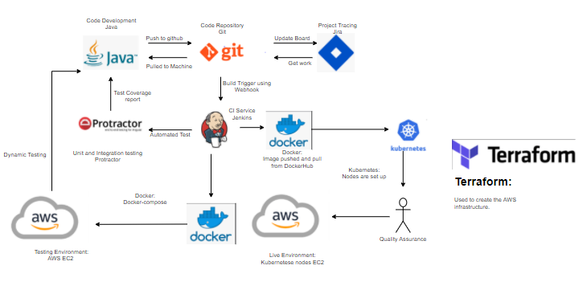
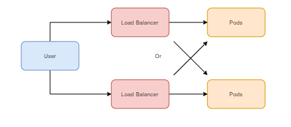
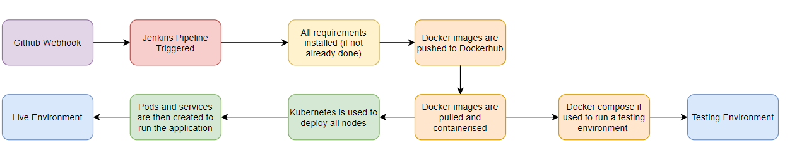
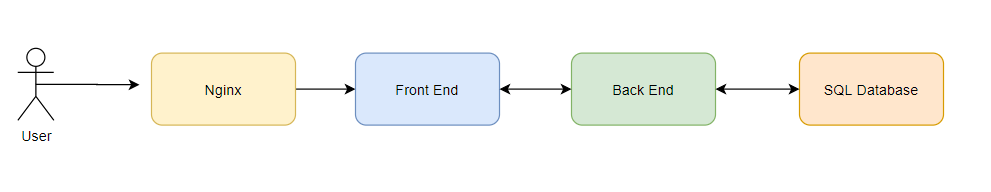

# SFIA3 Project

## Contents 

- [SFIA3 Project](#sfia3-project)
  - [Contents](#contents)
- [Project Brief](#project-brief)
    - [Resources](#resources)
    - [Brief](#brief)
- [Project Approach](#project-approach)
  - [Architecture](#architecture)
    - [Technologies](#technologies)
        - [Docker](#docker)
        - [Terraform](#terraform)
        - [Jenkins](#jenkins)
        - [Kubernetes](#kubernetes)
        - [AWS](#aws)
        - [GCP](#gcp)
        - [NGINX](#nginx)
    - [CI Pipeline](#ci-pipeline)
    - [Terraform Infrastructure](#terraform-infrastructure)
    - [Communications Diagram](#communications-diagram)
    - [Flow Diagram](#flow-diagram)
    - [Service Diagram](#service-diagram)
    - [Risk Assessment](#risk-assessment)
  - [Pricing](#pricing)
# Project Brief

### Resources
- Presentation: https://docs.google.com/presentation/d/1tvuw0aGp5gTRX3qS1x5JMbOMQaaJ4SjNRMDnN6zt6Pc/edit#slide=id.p
- Project Tracking: https://wdprojects.atlassian.net/jira/software/projects/TP/boards/8/backlog

### Brief
- The main project specification is to deploy the applications for the 'Sprint Pet Clinic Domain', one of which is the front end client using AngularJS and the other as an API using Java. The project is to be deployed using technologies we have learned.

- The project is a group project so it will need to be designed and implemented in an agile environment with stand ups and scrum roles assigned to team members. These workflows need to be demonstrated and discussed in the final presentation.

# Project Approach

## Architecture

### Technologies

##### Docker
Docker and Docker compose was used to build images the services and push to the DockerHub repository. Docker swarm was not used to deploy the application.
##### Terraform
Terraform is an infrastructure as code software. This was used to provision the network environment which was used to host the application. 
##### Jenkins
Jenkins is a CI Server, it was used to automate deployment once changes were made on the GitHub repository.
##### Kubernetes
Kubernetes is a container orchestration system which was used to deploy the application on to cthe cluster.
##### AWS
AWS is the cloud provider used to deploy the application in the production environment.
##### GCP
GCP was the cloud provider which we used as a testing environment to ensure all components of the application worked with each other when it was deployed.
##### NGINX
NGINX was a web server which was used as a reverse proxy to communicate from ports to services of the application.

### CI Pipeline

### Terraform Infrastructure

### Communications Diagram

### Flow Diagram

### Service Diagram

### Risk Assessment
https://docs.google.com/spreadsheets/d/1ugAB8bjxak-hNdU5zoV2xeDmLR60JVsaULNUSeTxHOk/edit#gid=0
## Pricing
